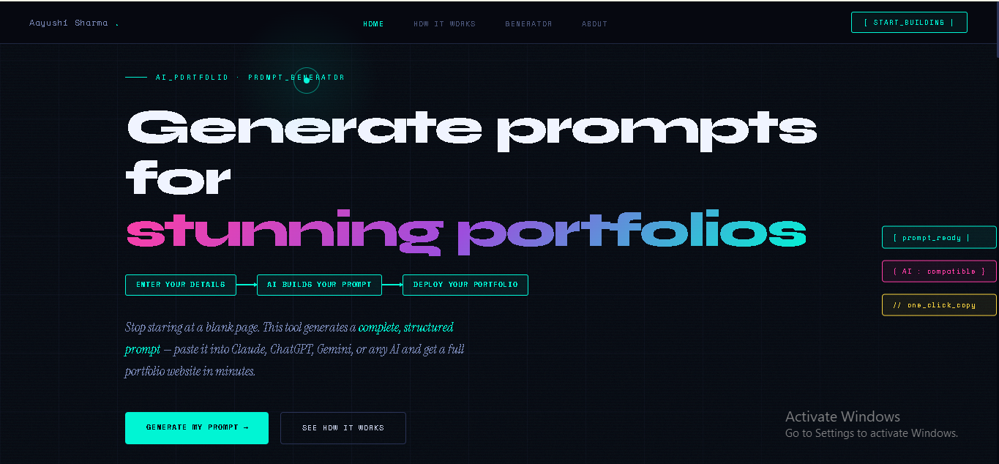
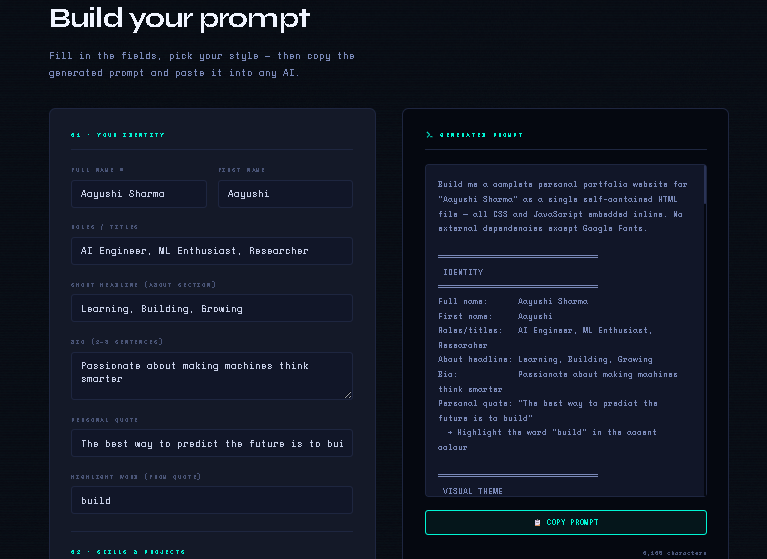

# Portfolio Prompt Generator

An AI-powered platform that helps users generate professional portfolio website prompts instantly.

Users simply fill out a form with their:
- personal details
- skills
- projects
- experience
- portfolio preferences

The platform then generates optimized prompts that can be used with AI tools like Claude or ChatGPT to instantly create portfolio websites.

---

## Features

- AI-powered prompt generation
- Modern futuristic UI
- Responsive design
- Portfolio detail form
- Instant prompt output
- Copy-to-clipboard functionality
- Smooth user experience

---

## Tech Stack

- HTML
- CSS
- JavaScript
- AI-Assisted Development using Claude

---

## How It Works

1. User fills out portfolio details
2. Platform generates optimized AI prompt
3. User copies prompt
4. Prompt can be used in Claude/ChatGPT to generate a portfolio website

---

## Live Demo

[https://portfoliopromptgenerator.netlify.app/](https://portfoliopromptgenerator.netlify.app/)

---

## Screenshots

### Homepage

### Generated Prompt

---

## Future Improvements

- Multiple portfolio themes
- Direct AI integration
- Export options
- Portfolio previews
- Deployment support

---

## Author

Aayushi Sharma
